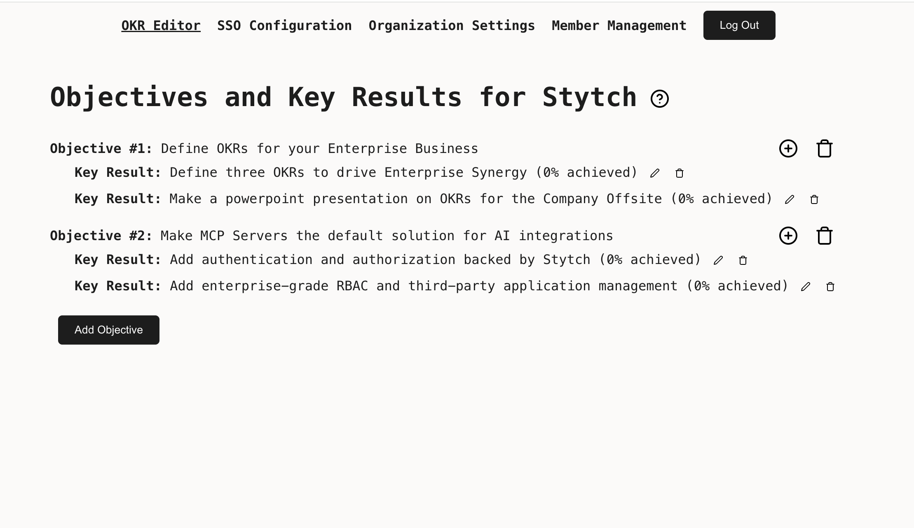

# Workers + Stytch OKR Manager MCP Server

This is a Workers server that composes three functions:
* A static website built using React and Vite on top of [Worker Assets](https://developers.cloudflare.com/workers/static-assets/)
* A REST API built using Hono on top of [Workers KV](https://developers.cloudflare.com/kv/) 
* A [Model Context Protocol](https://modelcontextprotocol.io/introduction) Server built using on top of [Workers Durable Objects](https://developers.cloudflare.com/durable-objects/)

Member, Tenant, and client identity is managed using [Stytch](https://stytch.com/). Put together, these three features show how to extend a traditional full-stack CRUD application for use by an AI agent.

This demo uses the [Stytch B2B](https://stytch.com/b2b) product, which is purpose-built for B2B SaaS authentication requirements like multi-tenancy, MFA, and RBAC. 
If you are more interested in Stytch's [Consumer](https://stytch.com/b2c) product, see [this demo](https://github.com/stytchauth/mcp-stytch-consumer-todo-list/) instead.



## Set up

Follow the steps below to get this application fully functional and running using your own Stytch credentials.

We will be creating a complex RBAC policy with 3 personas that interacts with both Stytch-defined resources and custom resources managed by the application.
At the end we will have:
- A `stytch_admin` role with universal access to all resources within an organization. They will have control over `objectives`, `key_results`, and all predefined Stytch resources like members, authentication settings, and SSO configuration.
- A `manager` role with partial access to most resources - they may invite new members and manage `key_results`, but cannot set top-level company `objectives`
- A `stytch_member` role with limited access to most resources - they may view `objectives` and update their progress on achieving `key_results`

We will also create a set of scopes that our users can grant to third-party applications. In order for a user to grant a scope to an application, they must have all of the permissions that scope encompasses. For example  
- The `read:okrs` scope requests only `read` access on resources, and is grantable by all members
- The `manage:krs` scope requests write access to the `key_results` resource, and is grantable by members with the `manager` or `stytch_admin` role, but not members with the `stytch_user` role
- The `manage:objectives` scope requests write access to the `objectives`, and is only grantable by members with the `stytch_admin` role


### In the Stytch Dashboard

1. Create a [Stytch](https://stytch.com/) account. Within the sign up flow select **B2B Authentication** as the authentication type you are interested in. Once your account is set up a Project called "My first project" will be automatically created for you.

2. Navigate to [Frontend SDKs](https://stytch.com/dashboard/sdk-configuration) to enable the Frontend SDK in Test

3. Navigate to [Connected Apps](https://stytch.com/dashboard/connected-apps) to enable Dynamic Client Registration

4. Navigate to [Project Settings](https://stytch.com/dashboard/project-settings) to view your Project ID and API keys. You will need these values later.

5. Navigate to [Management API](https://stytch.com/dashboard/settings/management-api) and create a new workspace management key. Copy the Key ID and Secret, you will need these values later.

### On your machine

1. In your terminal, clone the project, make sure we're using a minimum supported version of `node`, and install dependencies:

```bash
git clone https://github.com/stytchauth/mcp-stytch-b2b-okr-manager.git
cd mcp-stytch-b2b-okr-manager
nvm use
npm i
```


2. Create an `.env.local` file by running the command below which copies the contents of `.env.template`.

```bash
cp .env.template .env.local
```


3. Open `.env.local` in the text editor of your choice, and set the environment variables using the `public_token` found on [Project Settings](https://stytch.com/dashboard/project-settings?env=test).

```
# This is what a completed .env.local file will look like
VITE_STYTCH_PUBLIC_TOKEN=public-token-test-abc123-abcde-1234-0987-0000-abcd1234
```


4. Open `.dev.vars` in the text editor of your choice, and set the environment variables using the `Project ID` and `Secret`  found on [Project Settings](https://stytch.com/dashboard/project-settings?env=test).
```
// This is what a completed .dev.vars file will look like
STYTCH_PROJECT_ID=project-test-6c20cd16-73d5-44f7-852c-9a7e7b2ccf62
STYTCH_PROJECT_SECRET=secret-test-.....
```


5. Update your Stytch RBAC Policy by running the following command, using the workspace management `Key ID` and `Secret` you created earlier, and the `Project ID` found on [Project Settings](https://stytch.com/dashboard/project-settings). You can view and edit the created RBAC Roles, Resources and Scopes in [Roles & Permissions](https://stytch.com/dashboard/rbac).
```
// Using example credentials, replace with your own
npm run update-policy -- --key-id "workspace-key-prod-4881b817-6336-410a-a953-6eceabaf5xc9" --secret "6ZcNGH7v9Oxxxxxxxxxx" --project-id "project-test-6c20cd16-73d5-44f7-852c-9a7e7b2ccf62"
```


## Running locally

After completing all the setup steps above the application can be run with the command:

```bash
npm run dev
```

The application will be available at [`http://localhost:3000`](http://localhost:3000) and the MCP server will be available at `http://localhost:3000/sse`.

Test your MCP server using the [MCP Inspector](https://modelcontextprotocol.io/docs/tools/inspector)
```bash
npx @modelcontextprotocol/inspector@latest
```

Navigate to the URL where the Inspector is running, and input the following values:
- Transport Type: `SSE`
- URL: `http://localhost:3000/sse`

Click Connect to test the authorization flow and interacting with the Objectives and Key Results via your MCP Server!


##  Deploy to Cloudflare Workers
Click the button - **you'll need to configure environment variables after the initial deployment**.

[](https://deploy.workers.cloudflare.com/?url=https://github.com/stytchauth/mcp-stytch-b2b-okr-manager.git)

Or, if you want to follow the steps by hand:

1. Create a KV namespace for the OKR Manager app to use
```
npx wrangler kv namespace create OKRManagerKV
```

2. Update the KV namespace ID in `wrangler.jsonc` with the ID you received:
```
"kv_namespaces": [
   {
      "binding": "OKRManagerKV",
      "id": "your-kv-namespace-id"
   }
]
```

3. Upload your Stytch Project ID and Secret Env Vars for use by the worker
```bash
npx wrangler secret bulk .dev.vars
```

4. Deploy the worker
```
npm run deploy
```

5. Grant your deployment access to your Stytch project. Assuming your Stytch project was deployed at `https://mcp-stytch-b2b-okr-manager.$YOUR_ACCOUNT_NAME.workers.dev`:
   1. Add `https://mcp-stytch-b2b-okr-manager.$YOUR_ACCOUNT_NAME.workers.dev/authenticate` as an allowed [Redirect URL](https://stytch.com/dashboard/redirect-urls?env=test)
   2. Add `https://mcp-stytch-b2b-okr-manager.$YOUR_ACCOUNT_NAME.workers.dev` as an allowed Authorized Application in the [Frontend SDKs](https://stytch.com/dashboard/sdk-configuration?env=test) configuration

## Get help and join the community

#### :speech_balloon: Stytch community Slack

Join the discussion, ask questions, and suggest new features in our [Slack community](https://stytch.com/docs/resources/support/overview)!

